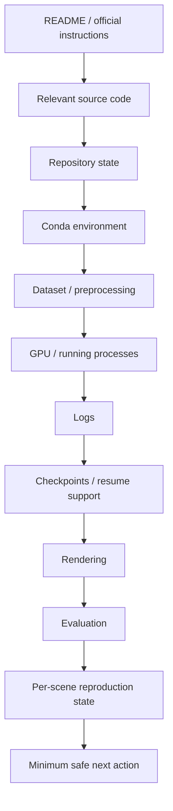

# PRSC — Paper Reproduction Safety Check

> A reusable safety-first workflow for auditing and continuing research-code reproductions without blindly reinstalling environments, modifying source code, deleting evidence, or restarting experiments.

[](LICENSE)
[](#release-status)

`paper-reproduction-safety-check` is an Agent Skill for research-code reproduction workflows, especially projects involving:

- 3D Gaussian Splatting
- 4D / Dynamic Gaussian Splatting
- NeRF
- Computer Vision
- Computer Graphics
- Robotics
- Deep Learning research repositories

Its core principle is:

> **Inspect first. Understand second. Execute last.**

---

## Why PRSC?

A research server is rarely in a clean state. It may already contain:

- Conda environments
- downloaded or preprocessed datasets
- partially completed training
- checkpoints
- rendered results
- evaluation metrics
- modified configurations
- active GPU jobs
- failed experiments and useful logs

A naive reproduction workflow may immediately suggest:

```bash
conda create ...
pip install ...
python train.py ...
```

That can cause duplicated environments, broken dependencies, overwritten experiments, unnecessary retraining, GPU conflicts, incorrect dataset settings, or loss of debugging evidence.

PRSC instead asks three questions first:

```text
1. What does the repository actually require?
2. What has already been completed on this machine?
3. What is the minimum safe next action?
```

---

## What It Does

PRSC audits a reproduction in roughly this order:



The README is not treated as the only source of truth. PRSC also inspects the implementation that actually controls training, dataset loading, checkpointing, rendering, and evaluation.

---

## Key Safety Rules

PRSC is designed around a few strict defaults:

- **Reuse existing environments first.** Start with `conda env list` and inspect compatibility before creating another environment.
- **Preserve old results and local modifications.** Do not casually run destructive commands such as `rm -rf`, `git reset --hard`, or `git clean -fd`.
- **Do not restart just because training stopped.** Inspect checkpoints and resume support first.
- **A checkpoint is not automatically a finished experiment.** Compare it with the official target iteration or epoch.
- **Training completion is not automatically full reproduction.** Verify render and evaluation when they are part of the target pipeline.
- **Diagnose before patching.** Check command, working directory, environment, dependencies, data, config, checkpoint, and GPU state before modifying source code.
- **Isolate batch failures.** One scene should not terminate unrelated scenes by default.

---

## Reproduction States

PRSC uses explicit evidence-based states such as:

| State | Meaning |
| --- | --- |
| `NOT_STARTED` | Target experiment has not started |
| `ENV_ERROR` | Environment or dependency problem |
| `DATA_ERROR` | Dataset or preprocessing problem |
| `TRAINING` | Training is currently active |
| `TRAIN_INTERRUPTED` | Training stopped before the target |
| `TRAIN_FINISHED` | Target training finished, downstream work may remain |
| `RENDER_FINISHED` | Rendering finished |
| `EVAL_FINISHED` | Evaluation finished |
| `COMPLETE` | The user's requested reproduction target is fully verified |
| `FAILED` | A confirmed failure blocks the current stage |
| `UNKNOWN` | Evidence is insufficient |

For multi-scene experiments, PRSC reports state per scene rather than collapsing everything into a vague global answer.

Example:

```text
scene                 train          render   eval   status
---------------------------------------------------------------
coffee_martini        30000/30000    YES      YES    COMPLETE
cook_spinach          30000/30000    NO       NO     TRAIN_FINISHED
cut_roasted_beef      12000/30000    NO       NO     TRAIN_INTERRUPTED
```

---

## Repository Structure

The repository contains a standards-oriented skill package under `paper-reproduction-safety-check/`:

```text
PRSC-Paper-Reproduction-Safety-Check/
├── README.md
├── CHANGELOG.md
├── RELEASE_NOTES_v0.1.0.md
├── LICENSE
├── .gitignore
├── examples/
│   ├── 3dgs-reproduction-check.md
│   └── batch-safe-run.sh
└── paper-reproduction-safety-check/
    ├── SKILL.md
    ├── references/
    │   ├── reproduction-audit.md
    │   ├── debugging-policy.md
    │   └── 3dgs-reproduction-check.md
    └── scripts/
        └── batch-safe-run.sh
```

The skill package uses progressive disclosure:

- `SKILL.md` contains the core behavior and safety policy.
- `references/` contains detailed audit, debugging, and end-to-end material.
- `scripts/` contains reusable execution patterns.

This keeps the core skill concise while preserving detailed guidance when needed.

---

## Installation

Clone the repository:

```bash
git clone https://github.com/Jincheng258/PRSC-Paper-Reproduction-Safety-Check.git
cd PRSC-Paper-Reproduction-Safety-Check
```

The installable skill directory is:

```text
paper-reproduction-safety-check/
```

For an Agent Skills-compatible client or agent runtime, add or import that directory as a skill according to the client's skill-loading mechanism.

The skill manifest is:

```text
paper-reproduction-safety-check/SKILL.md
```

---

## Example Prompt

```text
Use the paper-reproduction-safety-check workflow for this repository.

Goal:
<target reproduction>

Repository:
<repository URL>

Server path:
<repository path>

Dataset:
<dataset path>

Preferred GPU:
<GPU index>

Requirements:
1. Read the README and relevant source code first.
2. Determine how far the current reproduction has progressed.
3. Check `conda env list` and prefer existing environments.
4. Check dataset, preprocessing, dependencies, GPU, processes,
   logs, checkpoints, rendering, and evaluation.
5. Do not blindly reinstall dependencies.
6. Do not blindly modify source code.
7. Do not blindly restart full training.
8. Explain the official pipeline and relevant code path.
9. Identify missing stages and risks.
10. Give the minimum safe next operation.
11. For batch Bash scripts:
    - make them tmux-friendly
    - save logs
    - do not use `set -e`
    - do not terminate the batch because one scene failed
    - print clear SUCCESS / FAILED status
12. If something is uncertain, inspect evidence instead of guessing.
```

---

## Safe Batch Execution

A failed scene should normally not terminate the entire batch.

The reusable example is available at:

```text
paper-reproduction-safety-check/scripts/batch-safe-run.sh
```

The key pattern is:

```bash
python train.py ... 2>&1 | tee "$SCENE_LOG"
status=${PIPESTATUS[0]}

if [ "$status" -ne 0 ]; then
    echo "FAILED: $scene"
    continue
fi
```

This preserves logs, captures the actual training command's exit status, and allows unrelated scenes to continue.

Do not default to `set -e` or batch-level `exit` for independent multi-scene experiments.

---

## End-to-End Example

A realistic dynamic Gaussian / DyNeRF walkthrough is included here:

```text
paper-reproduction-safety-check/references/3dgs-reproduction-check.md
```

It demonstrates the full flow:

```text
repository inspection
        ↓
environment validation
        ↓
dataset validation
        ↓
checkpoint + log audit
        ↓
render / evaluation audit
        ↓
per-scene status table
        ↓
minimum safe continuation plan
```

The example intentionally shows mixed states: completed scenes, interrupted training, missing render/eval, a locally modified config, and a failed config-path run.

---

## What PRSC Avoids

```text
✗ Blind pip install
✗ Blind conda create
✗ Blind git pull
✗ Blind source patching
✗ Blind retraining
✗ Deleting previous experiment evidence
✗ Occupying arbitrary GPUs
✗ Assuming README is always correct
✗ Treating any checkpoint as completed training
✗ Treating training completion as full reproduction
```

---

## Intended Role

PRSC is designed to make an AI research assistant behave less like a:

```text
Command Generator
```

and more like a:

```text
Repository Inspector
        +
Experiment Auditor
        +
Debugging Assistant
        +
Reproduction Planner
```

---

## Reproduction Checklist

Before major execution:

```text
[ ] README inspected
[ ] relevant source code inspected
[ ] repository state inspected
[ ] Conda environments inspected
[ ] candidate environment validated
[ ] dataset checked
[ ] preprocessing checked
[ ] GPU checked
[ ] matching processes checked
[ ] logs checked
[ ] checkpoints checked
[ ] resume behavior checked if needed
```

Before declaring a full quantitative reproduction complete:

```text
[ ] target training iteration/epoch reached
[ ] checkpoint verified
[ ] rendering completed
[ ] render output count checked
[ ] official evaluation completed
[ ] metrics saved
[ ] no unresolved fatal errors
```

---

## Release Status

Current project version:

```text
0.1.0
```

See [`CHANGELOG.md`](CHANGELOG.md) for version history and [`RELEASE_NOTES_v0.1.0.md`](RELEASE_NOTES_v0.1.0.md) for the initial release summary.

---

## License

This project is licensed under the [MIT License](LICENSE).

---

## Philosophy

> **Never restart a reproduction experiment before understanding its current state.**

**Inspect first. Understand second. Execute last.**
